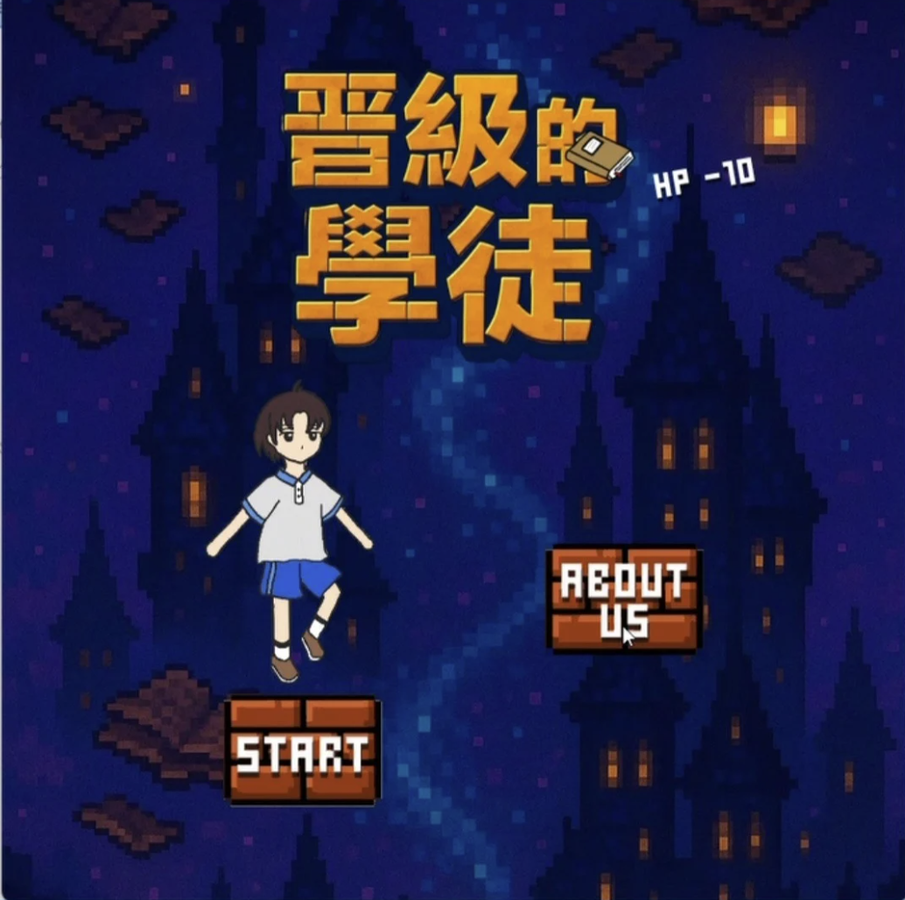
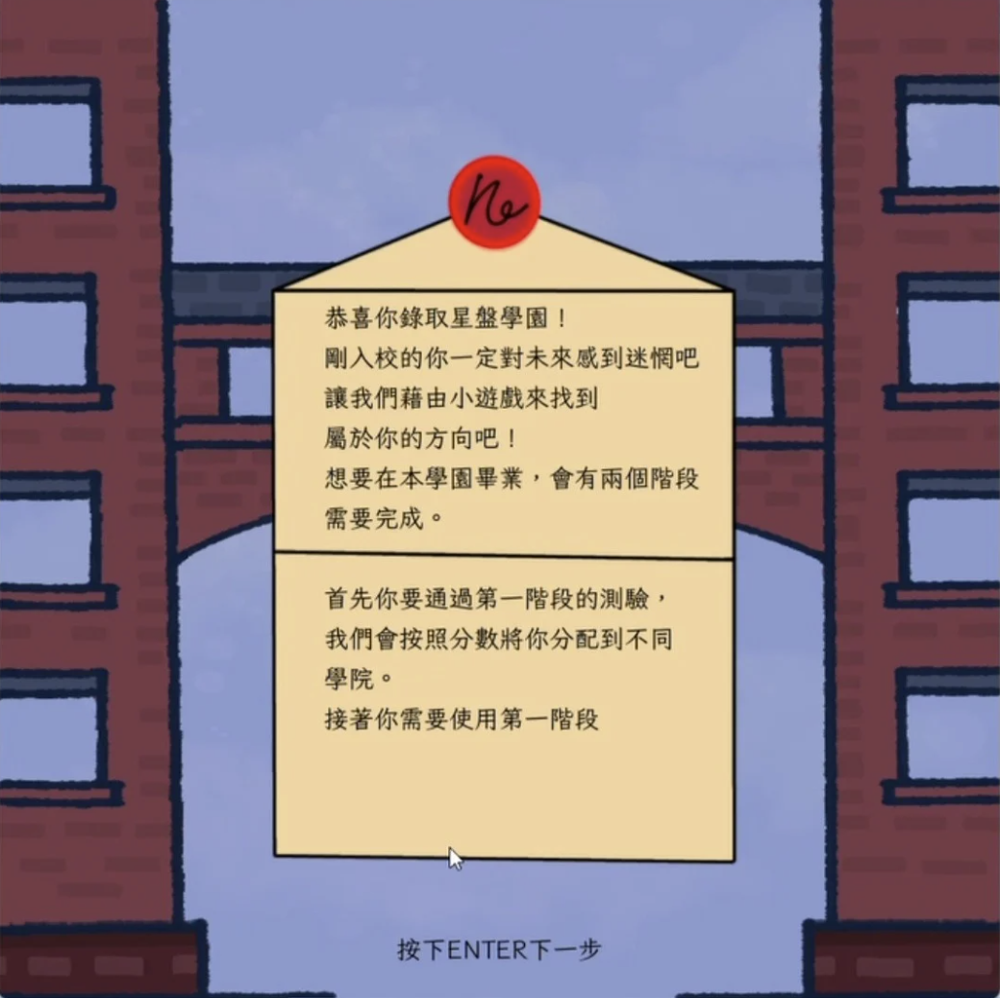
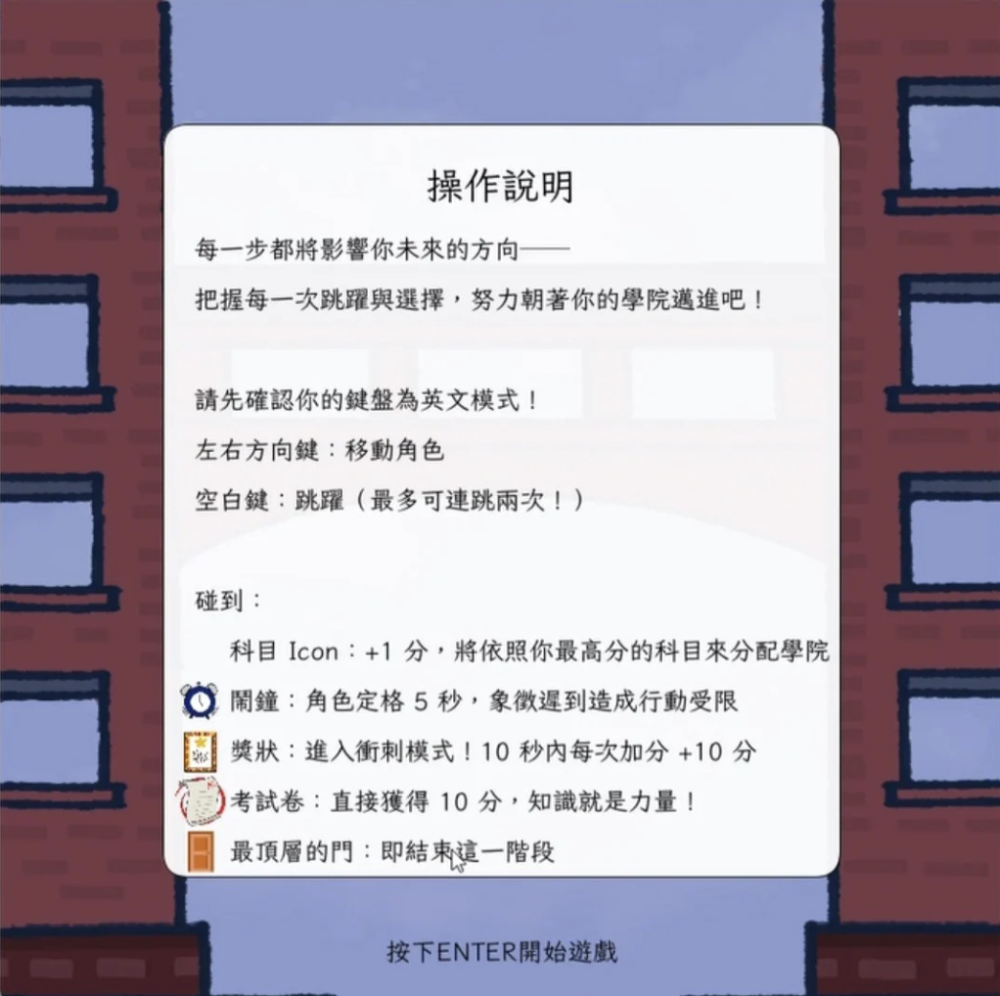
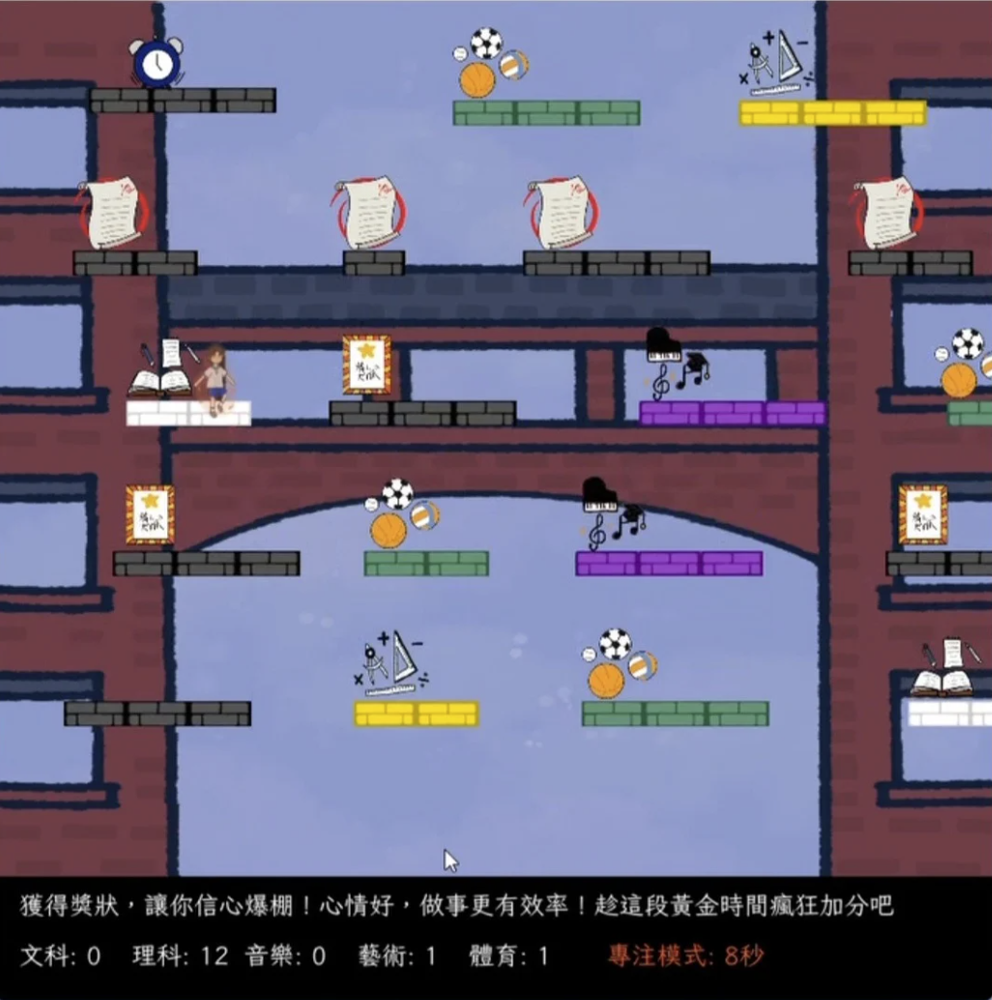
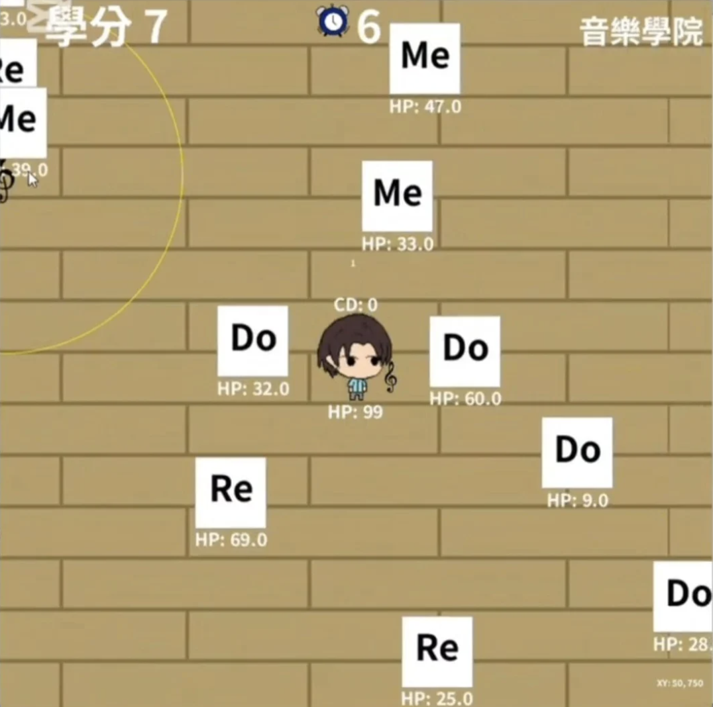
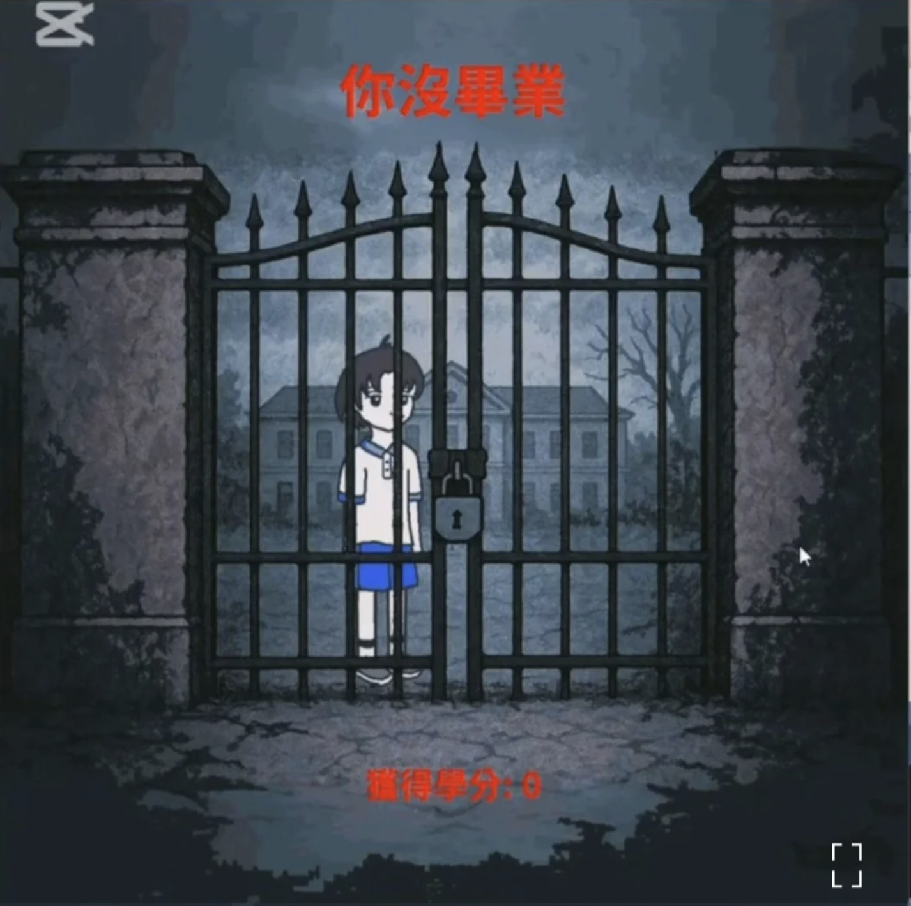
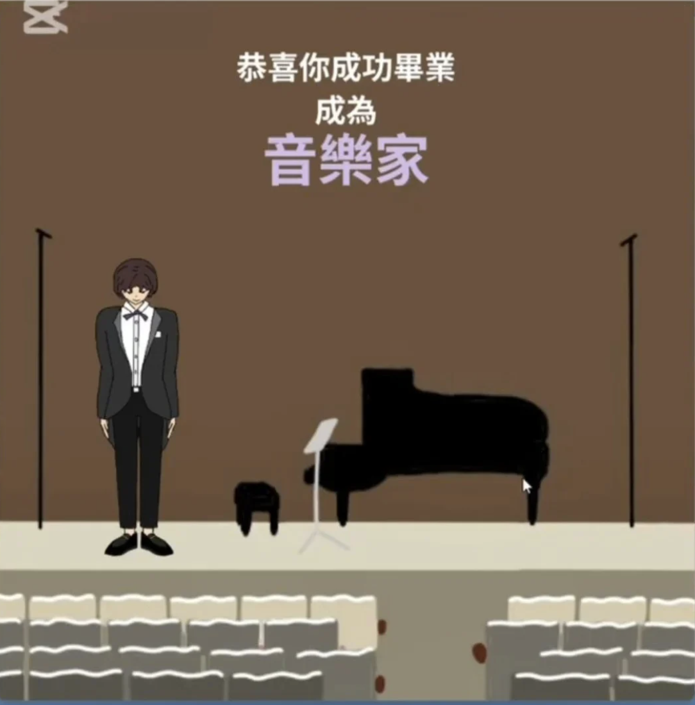

# Journey-of-Growth

A Processing game let players explore and grow through two stage mini games. 
By jumping to collect points and battling to accumulate credits, players are guided to discover their academic inclinations and simulate the process of career development.

  
  

## How to Play

Players will challenge two stages:

- Stage 1: Get assigned to a college through gameplay.
- Stage 2: Take on exclusive missions based on your assigned college.

We hope that through gamified design, learning and career exploration become more engaging.

---

### Stage 1: Exploring Interests

Players will accumulate scores for different subjects through a platform-jumping mini-game. Based on the highest score, you’ll be assigned to the corresponding college.
You can move your character left and right and jump. Along the way, you’ll encounter various icons representing events:

- Subject Icon: +1 point, used to determine your college assignment.
- Alarm Clock: Freezes your character for 5 seconds, symbolizing the impact of being late on actions and mood.
- Certificate: Enter a 10-second sprint mode, each score +10, representing a boost in motivation.
- Exam Paper: Enter a random quiz, gain 10 points, symbolizing "knowledge is power."
- Top-level Door: Touching it ends this stage and moves you to the college challenge.
- 

  
  

### Stage 2: Defeat Subject Monsters
After entering your college, you’ll face career challenges by defeating monsters representing different subjects to accumulate credits.
Your character stays in the center of the screen. Use the WASD keys to move the view and the mouse to attack. Each college has different weapons and skills, offering unique gameplay.

- When credits reach 10, you can enter the shop to upgrade abilities.
- If credits reach 20, you graduate successfully.
- If your health drops to zero, the challenge fails.

  
  
  
  

## Demo videos
[Youtube demo video](https://youtu.be/yVHSTGoemms?si=893hXAyIcP9cTwun)